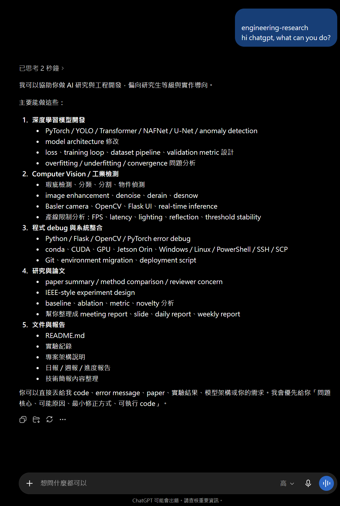

# Engineering Research Skills

Reusable Agent Skills instructions for graduate-level AI/ML research and engineering workflows.

本 repository 將深度學習研究、computer vision、model debugging、experiment design、industrial defect detection、technical reporting 與 edge deployment 的工作流程整理成可重用 skill。

## Scope

`engineering-research` 適合需要研究級分析或工程判斷的任務：

- PyTorch / OpenCV model training and debugging
- Image enhancement, classification, anomaly detection, defect detection
- Paper review, novelty analysis, experiment design, ablation planning
- ONNX / TensorRT / Jetson inference optimization
- Daily report, weekly report and experiment result writing

它不應攔截一般程式設計、單純 Git 操作、一般文案或非 ML environment setup。

## Quick Start

```bash
git clone https://github.com/mcodare709/Engineering-research-skills.git
```

主要入口：

```text
skills/engineering-research/SKILL.md
```

將完整的 `skills/engineering-research/` 目錄複製到支援 Agent Skills 的 client。若 client 不支援 reference file 載入，可將 `SKILL.md` 與所需的 `references/*.md` 合併至 system prompt 或 custom instruction。

## Validate

```bash
python scripts/validate_skill.py
```

Validator 會檢查 `SKILL.md`、frontmatter、relative links、reference files、eval cases 與禁止提交的手動 ZIP。

## Package

```bash
python scripts/package_skill.py
```

輸出：

```text
dist/engineering-research.zip
```

ZIP 由 source directory 自動產生，避免 source 與壓縮檔版本不同步。

## Repository Structure

```text
Engineering-research-skills/
├── .github/workflows/validate.yml
├── CHANGELOG.md
├── LICENSE
├── README.md
├── docs/images/
├── evals/
│   ├── output-cases.yaml
│   └── trigger-cases.yaml
├── scripts/
│   ├── package_skill.py
│   └── validate_skill.py
└── skills/
    └── engineering-research/
        ├── SKILL.md
        └── references/
            ├── code-rules.md
            ├── debug.md
            ├── defect-detection.md
            ├── deployment.md
            ├── reporting.md
            ├── research.md
            └── training.md
```

## Compatibility

| Client type | Installation | Status |
|---|---|---|
| Agent Skills-compatible client | Copy skill directory | Primary target |
| ChatGPT / custom GPT instruction | Upload or paste relevant files | Manual integration |
| Claude-compatible client | Copy skill directory | Expected compatible |
| Gemini custom instruction | Paste selected instructions | Experimental |

Compatibility depends on whether the client supports automatic reference-file loading and tool access.

## Screenshots

<div align="center">
  
  
  
</div>

## License

MIT License.
