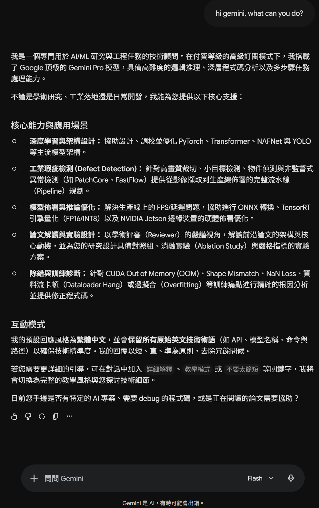
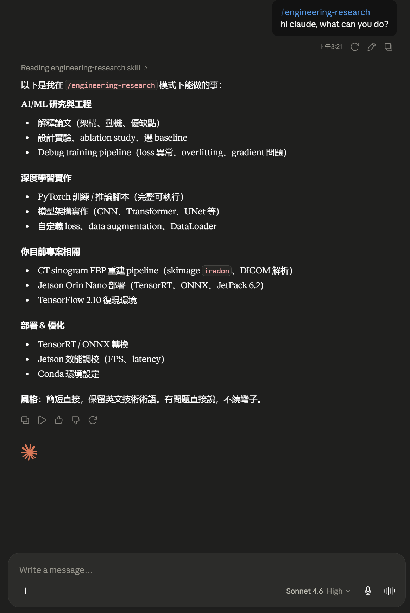

# Engineering Research Skills

LLM skill files for AI/ML research and engineering workflows.

This repository packages personal workflow habits into reusable skill instructions for large language models. Designed for deep learning research, computer vision engineering, model debugging, experiment design, paper review, and edge AI deployment.

> 這是個人工作流程習慣的測試版本，仍在持續迭代改進。如有不完善之處，請多多包容。

---

## Quick Start

```bash
git clone https://github.com/mcodare709/Engineering-research-skills.git
```

Load the skill into your LLM environment:

```text
skills/engineering-research/SKILL.md
```

Copy the content of `SKILL.md` into a system prompt, custom instruction, agent skill file, or coding assistant configuration.

---

## Skills

### `engineering-research`

A concise technical assistant skill covering:

- Deep learning: model training, debugging, architecture modification, inference
- Frameworks: PyTorch, OpenCV, YOLO, NAFNet, Transformer, U-shape, FFT, Wavelet
- Tasks: image enhancement, defect detection, anomaly detection, classification
- Research: paper review, experiment design, method comparison, IEEE-style reporting
- Deployment: edge AI, Jetson Orin Nano, TensorRT, ONNX, real-time inference
- Tooling: Git, CUDA, conda, checkpoint management, Windows / PowerShell / Linux

**Default language**: Traditional Chinese, with English preserved for all technical terms.

---

## Repository Structure

```text
Engineering-research-skills/
├── README.md
├── LICENSE
├── pit
└── skills/
    ├── engineering-research.zip/
    └── engineering-research/
        ├── SKILL.md
        └── references/
            ├── training.md
            ├── deployment.md
            ├── defect-detection.md
            ├── research.md
            ├── debug.md
            └── code-rules.md
```

`SKILL.md` is the main entry point. The `references/` files are loaded on demand — the LLM reads only the file relevant to the current task.

---

## Test Gemini, ChatGPT, Claude
<div align="center">
  
  
  
</div>

## License

MIT License.